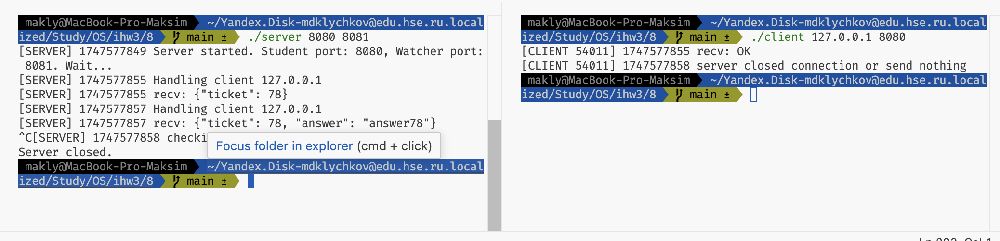

# ИДЗ-3

*Клычков Максим Дмитриевич. БПИ237. Вариант 29.*

## Текст задания

> **Задача про экзамен.** Преподаватель проводит экзамен у группы студентов. Каждый студент получает свой билет, сообщает его
номер и готовит письменный ответ за некоторое случайное время.
Подготовив ответ, он передает его преподавателю. Преподаватель
некоторое случайное время просматривает ответ и сообщает студенту оценку

> ***Требуется создать клиент–серверное приложение, моделирующее действия преподавателя и студентов.***

> *Преподаватель — сервер. Каждый студент — отдельный клиент. Для автоматизации запуска студентов можно использовать скрипт, организующий поступление клиентов со случайной задержкой. Необходимо учесть, что одновременно сдавать экзамен может несколько студентов. То есть, сервер должен обслуживать более одного клиента.*

## Общая схема решения

Сервер-преподаватель в однопоточном режиме обслуживает клиентов-студентов (преподаватель всего один, не может разделиться сразу на нескольких студентов). Сначала клиент отправляет серверу случайное число — номер билета, преподаватель дополнительно подтверждает билет студента в ответ. Студент готовиться произвольное время, не превышающее общего ограничения на время подготовки от преподавателя. Далее студент посылает свой ответ серверу преподавателю, тот случайное время просматривает его и сообщает оценку.

## 4-5 баллов

### Логика сервера

Сервер-преподаватель работает до тех пор, пока не получит сигнал SIGINT. Он создает сокет и ждет подключения клиентов-студентов. Сервер обрабатывает два вида запросов от студентов:

1. **Запрос на подтверждение билета**. Сервер получает номер билета от студента и отправляет подтверждение обратно.
2. **Запрос на оценку**. Сервер получает ответ от студента и отправляет оценку обратно, причем тратится случайное время на просмотр ответа, оценка выставляется случайная.

### Логика клиента

Клиент-студент создает сокет и подключается к серверу-преподавателю. Он отправляет номер билета и ждет подтверждения. После этого он готовит ответ в случайное время, отправляет его на сервер и ждет оценки.
После получения оценки клиент завершает свою работу.

### Запуск программы

Для компиляции используется простой Makefile:

```makefile
CC = gcc

.PHONY: all
all: server client

server: server.c error.c
	${CC} server.c error.c -o server

client: client.c error.c
	${CC} client.c error.c -o client

.PHONY: clean
clean:
	rm -f server client
```

Для запуска программы необходимо сначала запустить сервер, а затем несколько клиентов. Причем хочется видеть отдельные логи для каждого клиента. Для этого был написан [простой bash-скрипт](4-5/run_exam.sh), который запускает сервер и несколько клиентов и перенаправляет их вывод в отдельные файлы. Вывод каждой можно найти в [директории logs](4-5/logs/).

Приведу пример логов сервера и одного из клиентов.

#### Логи сервера

```
accept() failed: Interrupted system call
Server started. IP: 0.0.0.0, Port: 8080. Wait...
Handling client 127.0.0.1
[SERVER] 1747559739 recv: {"ticket": 33}
Handling client 127.0.0.1
[SERVER] 1747559739 recv: {"ticket": 61}
Handling client 127.0.0.1
[SERVER] 1747559739 recv: {"ticket": 47}
Handling client 127.0.0.1
[SERVER] 1747559739 recv: {"ticket": 68}
Handling client 127.0.0.1
[SERVER] 1747559739 recv: {"ticket": 54}
Handling client 127.0.0.1
[SERVER] 1747559739 recv: {"ticket": 82}
Handling client 127.0.0.1
[SERVER] 1747559739 recv: {"ticket": 40}
Handling client 127.0.0.1
[SERVER] 1747559739 recv: {"ticket": 89}
Handling client 127.0.0.1
[SERVER] 1747559739 recv: {"ticket": 96}
Handling client 127.0.0.1
[SERVER] 1747559739 recv: {"ticket": 75}
Handling client 127.0.0.1
[SERVER] 1747559743 recv: {"ticket": 96, "answer": "answer96"}
Handling client 127.0.0.1
[SERVER] 1747559746 recv: {"ticket": 89, "answer": "answer89"}
Handling client 127.0.0.1
[SERVER] 1747559749 recv: {"ticket": 82, "answer": "answer82"}
Handling client 127.0.0.1
[SERVER] 1747559750 recv: {"ticket": 75, "answer": "answer75"}
Handling client 127.0.0.1
[SERVER] 1747559755 recv: {"ticket": 54, "answer": "answer54"}
Handling client 127.0.0.1
[SERVER] 1747559759 recv: {"ticket": 47, "answer": "answer47"}
Handling client 127.0.0.1
[SERVER] 1747559761 recv: {"ticket": 68, "answer": "answer68"}
Handling client 127.0.0.1
[SERVER] 1747559765 recv: {"ticket": 61, "answer": "answer61"}
Handling client 127.0.0.1
[SERVER] 1747559767 recv: {"ticket": 40, "answer": "answer40"}
Handling client 127.0.0.1
[SERVER] 1747559769 recv: {"ticket": 33, "answer": "answer33"}
```

#### Логи клиента

```
[CLIENT 30382] 1747559739 recv: OK
[CLIENT 30382] 1747559755 recv: 5
Grade: 5
```

### Завершение работы сервера и клиента

Сервер завершает свою работу по сигналу SIGINT. Если в это время есть клиенты, то они получают от recv() 0 байт, что означает, что сервер закрыл соединение, клиенты тут же завершают свою работу.

Также в клиенте реализована обработка SIGINT. Если было открыто соединение с сервером, то клиент закрывает его и завершает свою работу.

## 6-7 баллов

Реализуем отдельную клиентскую программу, подключаемую к серверу, которая предназначена для отображение комплексной информации о выполнении приложения в целом.

Подключение клиента-наблюдателя будет происходить по другому порту, отличному от порта преподавателя. Будет поддерживаться соединение, запущенное в отдельном потоке.

### Клиент-наблюдатель

Код клиента-наблюдателя очень похож на простой эхо-клиент. Он создает сокет и подключается к серверу-преподавателю. После этого он ждет сообщения от сервера и выводит его на экран. Подключение закрывается по сигналу SIGINT или в тот момент, когда recv возвращает $\leq 0$ байт.

```c
{
  ...
  // Establish the connection to the server
  if (connect(sock, (struct sockaddr *)&servAddr, sizeof(servAddr)) < 0)
    DieWithError("connect() failed");

  char recvBuf[RCVBUFSIZE];
  int recvLen;
  // Receive and print logs from server
  while ((recvLen = recv(sock, recvBuf, RCVBUFSIZE - 1, 0)) > 0 &&
         !watcher_finish_flag) {
    recvBuf[recvLen] = '\0';
    printf("%s", recvBuf);
  }
  close(sock);
  return 0;
  ...
}
```

### Пример вывода наблюдателя

```
[SERVER] 1747568016 Handling client 127.0.0.1
[SERVER] 1747568016 recv: {"ticket": 22}
[SERVER] 1747568016 send: OK
[SERVER] 1747568016 Handling client 127.0.0.1
[SERVER] 1747568016 recv: {"ticket": 43}
[SERVER] 1747568016 send: OK
[SERVER] 1747568016 Handling client 127.0.0.1
[SERVER] 1747568016 recv: {"ticket": 29}
[SERVER] 1747568016 send: OK
[SERVER] 1747568016 Handling client 127.0.0.1
[SERVER] 1747568016 recv: {"ticket": 36}
[SERVER] 1747568016 send: OK
[SERVER] 1747568016 Handling client 127.0.0.1
[SERVER] 1747568016 recv: {"ticket": 57}
[SERVER] 1747568016 send: OK
[SERVER] 1747568016 Handling client 127.0.0.1
[SERVER] 1747568016 recv: {"ticket": 50}
[SERVER] 1747568016 send: OK
...
```

Вновь полный вывод каждой из программ можно найти в [директории logs](6-7/logs/).

## 8 баллов

### Общая схема решения

Будем поддерживать массив сокетов клиентов-наблюдателей, которые будут подключаться к серверу-преподавателю. Каждый раз, когда клиент-студент подключается к серверу, он будет добавляться в массив сокетов. Когда клиент-студент отключается, он будет удаляться из массива сокетов. Важно использовать использовать MSG_NOSIGNAL, чтобы не посылать сигнал SIGPIPE, когда клиент отключается. Это позволит избежать аварийного завершения сервера. Также мы используем `select()`, чтобы отслеживать события на сокетах клиентов-наблюдателей. Когда на сокете есть данные, мы читаем их и отправляем всем клиентам-наблюдателям.

Так выглядит отправка логов клиентам-наблюдателям:

```c
// Function to send a log message to all watcher clients
void send_log_to_watchers(const char *msg) {
  for (int i = 0; i < monitor_clients_count; ++i) {
    // Important to use MSG_NOSIGNAL to avoid block on sending to closed socket
    if (send(monitor_clients[i], msg, strlen(msg), MSG_NOSIGNAL) <= 0) {
      if (close(monitor_clients[i]) < 0)
        DieWithError("close() failed");
      for (int j = i; j < monitor_clients_count - 1; ++j)
        monitor_clients[j] = monitor_clients[j + 1];
      monitor_clients_count--;
      i--; // чтобы не пропустить следующий элемент
    }
  }
}
```

Обработка нескольких видов клиентов с помощью `select()` и `FD_SET()`:

```c
while (!server_finish_flag) {
  int maxfd = servSock > watcherSock ? servSock : watcherSock;
  FD_ZERO(&readfds);
  FD_SET(servSock, &readfds);
  FD_SET(watcherSock, &readfds);
  for (int i = 0; i < monitor_clients_count; ++i) {
    FD_SET(monitor_clients[i], &readfds);
    if (monitor_clients[i] > maxfd)
      maxfd = monitor_clients[i];
  }
  int activity = select(maxfd + 1, &readfds, NULL, NULL, NULL);
  if (server_finish_flag)
    break;
  if (activity < 0 && !server_finish_flag)
    DieWithError("select() failed");

  // Watcher client connected
  if (FD_ISSET(watcherSock, &readfds)) {
    unsigned int watcherClntLen = sizeof(watcherClntAddr);
    int new_monitor_sock = accept(
        watcherSock, (struct sockaddr *)&watcherClntAddr, &watcherClntLen);
    if (new_monitor_sock < 0)
      DieWithError("accept() failed for watcher");
    if (monitor_clients_count < MAX_MONITOR_CLIENTS) {
      monitor_clients[monitor_clients_count++] = new_monitor_sock;
      char logmsg[256];
      snprintf(logmsg, sizeof(logmsg),
                "[SERVER] %ld Watcher connected from %s\n", time(NULL),
                inet_ntoa(watcherClntAddr.sin_addr));
      printf("%s", logmsg);
      send_log_to_watchers(logmsg);
    } else {
      close(new_monitor_sock);
    }
  }

  // Student client connected
  if (FD_ISSET(servSock, &readfds)) {
    unsigned int clntLen = sizeof(echoClntAddr);
    int clntSock =
        accept(servSock, (struct sockaddr *)&echoClntAddr, &clntLen);
    if (clntSock < 0)
      DieWithError("accept() failed");
    char logmsg[256];
    snprintf(logmsg, sizeof(logmsg), "[SERVER] %ld Handling client %s\n",
              time(NULL), inet_ntoa(echoClntAddr.sin_addr));
    printf("%s", logmsg);
    send_log_to_watchers(logmsg);
    HandleTCPClient(clntSock);
  }
}
```

### Вывод программы

Был модифицирован скрипт [run_exam.sh](8/run_exam.sh), который теперь запускает сервер и несколько клиентов-студентов, а также клиента-наблюдателя, причем некоторые клиенты-наблюдатели подключаются до подключения клиентов-студентов, а некоторые — после. Логи можно посмотреть в [директории](8/logs/).

## 9-10 баллов

### Отключение и подключение клиентов с сохранением работоспособности сервера

Программа изначально реализовывалась таким образом, чтобы сервер мог обрабатывать отключения клиентов и не завершался при этом.
Например, так происходит обработка отключения клиента-студента при отправке оценки преподавателем:

```c
int grade = MIN_GRADE + rand() % (MAX_GRADE - MIN_GRADE + 1);
char gradeStr[4];
snprintf(gradeStr, sizeof(gradeStr), "%d", grade);
snprintf(logmsg, sizeof(logmsg), "[SERVER] %ld send: %s\n", time(NULL),
          gradeStr);
send_log_to_watchers(logmsg);
if (send(clntSocket, gradeStr, strlen(gradeStr), MSG_NOSIGNAL) !=
    (ssize_t)strlen(gradeStr)) {
  snprintf(logmsg, sizeof(logmsg), "[SERVER] %ld send failed\n",
            time(NULL));
  printf("%s", logmsg);
  send_log_to_watchers(logmsg);
}
```

Как и в предыдущем пункте, используется `MSG_NOSIGNAL`, чтобы не посылать сигнал SIGPIPE, когда клиент отключается. Это позволяет избежать аварийного завершения сервера.

### Завершение клиентов при отключении сервера

Программа изначально корректно обрабатывает отключение сервера. После закрытия сокета `recv()` получает $\leq 0$ байт, что как раз сигнализирует об отключении сервера. Поэтому никакие дополнительные сообщения об отключении клиентам посылать не нужно, достаточно закрыть все дескрипторы, а это возможно благодаря флагу, который переключается по сигналу SIGINT.

#### Демонстрация



