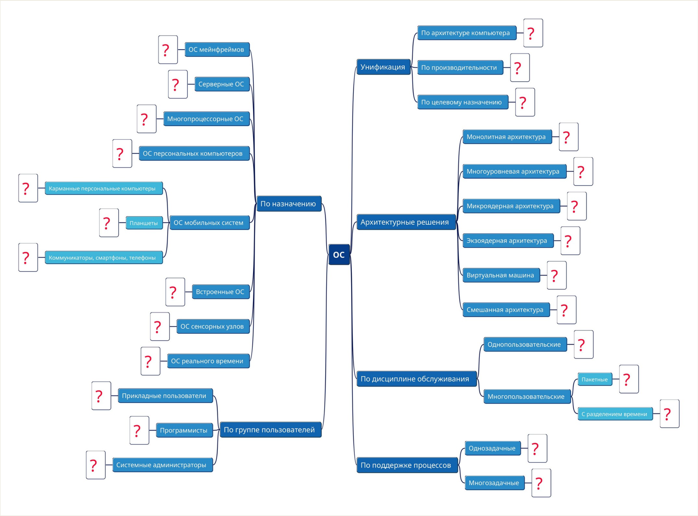

# Семинарское ДЗ-1

## Классификация ОС

### По назначению
- [ОС мэйнфреймов](https://www.ibm.com/docs/en/zos-basic-skills?topic=today-what-are-mainframe-operating-systems)
  - [z/OS](https://www.ibm.com/docs/en/zos-basic-skills?topic=systems-mainframe-operating-system-zos)
  - [Linux for System z](https://www.ibm.com/docs/en/zos-basic-skills?topic=systems-mainframe-operating-system-linux-system-z)
- [Серверные ОС](https://cio-wiki.org/wiki/Server_Operating_System##google_vignette)
  - [Windows Server](https://www.microsoft.com/en/windows-server)
  - Linux([Ubuntu Server](https://ubuntu.com/server))
- Многопроцессорные ОС
  - [Windows](https://www.microsoft.com/en/windows)
  - [Linux](https://www.kernel.org/)
- ОС персональных компьютеров
  - [Windows](https://www.microsoft.com/en/windows)
  - [macOS](https://developer.apple.com/macos)
- ОС мобильных систем
  - [Карманные персональные компьютеры](https://en.wikipedia.org/wiki/Personal_digital_assistant)
    - [PalmOS](https://en.wikipedia.org/wiki/Palm_OS)
    - [Windows Mobile](https://en.wikipedia.org/wiki/Windows_Mobile)
  - Планшеты
    - [Google Android](https://developer.android.com/)
    - [Apple iPadOS](https://developer.apple.com/ipados/)
  - Коммуникаторы, смартфоны, телефоны
    - [Google Android](https://developer.android.com/)
    - [Apple iOS](https://developer.apple.com/ios/)
- [Встроенные ОС](https://en.wikipedia.org/wiki/Embedded_operating_system)
  - [FreeRTOS](https://github.com/FreeRTOS/FreeRTOS) 
  - [PX5 RTOS](https://px5rtos.com/px5-rtos-embedded/)
- ОС сенсорных узлов
  - [TinyOS](http://www.tinyos.net/)
  - [FreeRTOS](https://github.com/FreeRTOS/FreeRTOS) 
- ОС реального времени
  - [FreeRTOS](https://github.com/FreeRTOS/FreeRTOS)
  - [VxWorks](https://www.windriver.com/products/vxworks)

### По группе пользователей

- Прикладные пользователи:
  - [Windows](https://www.microsoft.com/en/windows)
  - [macOS](https://developer.apple.com/macos)
- Программисты
  - Linux ([Ubuntu Desktop](https://ubuntu.com/desktop))
  - [FreeBSD](https://www.freebsd.org/)
- Системные администраторы:
  - Linux ([Debian](https://www.debian.org/))
  - Linux ([Fedora](https://fedoraproject.org/))

### Унификация

- По архитектуре компьютера
  - [Windows on ARM](https://learn.microsoft.com/en-us/windows/arm/overview)
  - [Windows x86](https://learn.microsoft.com/en-us/windows-hardware/drivers/debugger/x86-architecture)
- По производительности:
  - высокопроизводительная Linux([Ubuntu Server](https://ubuntu.com/server))
  - низкопроизводительная [Raspberry Pi OS](https://www.raspberrypi.com/software/)
- По целевому назначению:
  - ОС мобильных устройств [Google Android](https://developer.android.com/)
  - ОС встроенных систем [FreeRTOS](https://github.com/FreeRTOS/FreeRTOS) 

### Архитектурные решения

- [Монолитная архитектура](https://en.wikipedia.org/wiki/Monolithic_kernel)
  - [Linux](https://www.kernel.org/)
  - [MS-DOS](https://en.wikipedia.org/wiki/MS-DOS)
- Многоуровневая архитектура
  - [Multics](https://www.multicians.org)
  - [THE Operating System](https://en.wikipedia.org/wiki/THE_multiprogramming_system)
- Микроядерная архитектура
  - [QNX](https://www.qnx.com)
  - [Minix](https://www.minix3.org)
- [Экзоядреная архитектура](https://en.wikipedia.org/wiki/Exokernel)
 - [KeyKOS](https://en.wikipedia.org/wiki/KeyKOS)
 - [Adeos](https://www.opersys.com/adeos/)
- Виртуальная машина
 - [Microsoft Hyper-V](https://learn.microsoft.com/en-us/virtualization/hyper-v-on-windows/about/)
 - [VirtualBox](https://www.virtualbox.org/)
- Смешанная архитектура
  - [Windows](https://www.microsoft.com/en/windows)
  - [macOS](https://developer.apple.com/macos)

### По дисциплине обслуживания

- Однопользовательские
  - [MS-DOS](https://en.wikipedia.org/wiki/MS-DOS)
  - [Windows 95](https://en.wikipedia.org/wiki/Windows_95)
- Многопользовательские
  - [Linux](https://www.kernel.org/)
  - [Windows Server](https://www.microsoft.com/en/windows-server)

### По поддержке процессов

- Однозадачные
  - [MS-DOS](https://en.wikipedia.org/wiki/MS-DOS)
  - [PalmOS](https://en.wikipedia.org/wiki/Palm_OS)
- Многозадачные
  - [Windows](https://www.microsoft.com/en/windows)
  - [Linux](https://www.kernel.org/)

## [Опционально +1 балл] Источники

см. ссылки в классификации

## [Опционально +1 балл] «Крутая» ОС

Мне не принципиально, какой операционной системой пользоваться, главное, чтобы это была Unix-подобная система. Это обусловлено удобством работы с инструментами разработки, мощными возможностями командной строки и хорошей совместимостью с большинством нужного мне софта.

В данный момент я использую Ubuntu на ПК и macOS на ноутбуке. macOS на ноутбуке — это вынужденный выбор, так как альтернатив для Mac нет, а выбор Mac оправдан длительным временем работы, использованием ARM-архитектуры и высокой производительностью.